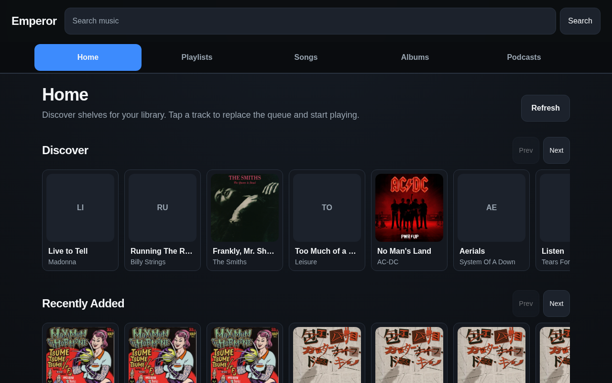
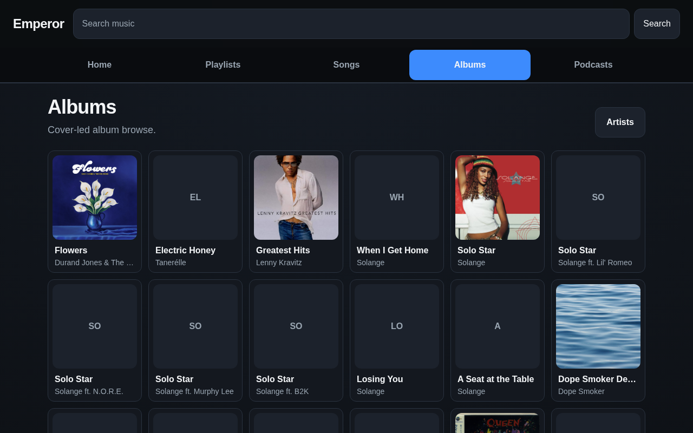
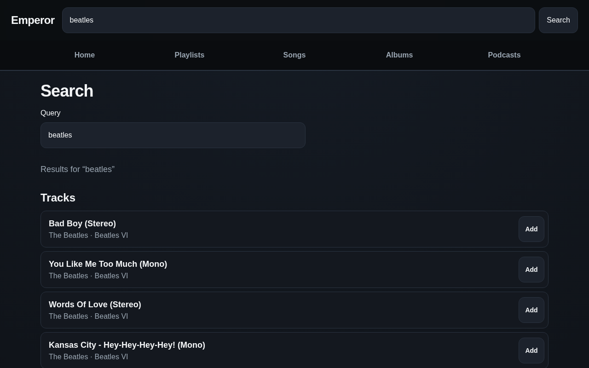

# Emperor

A SvelteKit web client for [personal-media-server](https://github.com/JTCorrin/personal-media-server) — browse your library, search, stream audio, and manage playlists against a LAN-hosted HTTP API.

This was built specifically so I could have a nice chunky interface when using my car screen.



## Features

- **Home shelves** — discover, recently added, recently played, playlists, and favourites
- **Browse** — artists, albums, and the full track list with cover art
- **Search** — tracks, artists, and albums (optional fuzzy matching)
- **Playback** — queue, shuffle/repeat, and compact now-playing bar
- **User library** — playlists, favourites, and play history (when the server runs with `--user-db`)
- **Metadata** — edit track/album tags in the catalog; optional MusicBrainz lookup and cover apply

Emperor auto-connects on load to `PUBLIC_MEDIA_SERVER_URL` (or a documented LAN default). See [AGENTS.md](./AGENTS.md) for the full [personal-media-server](https://github.com/JTCorrin/personal-media-server) API contract.

## Requirements

- [Node.js](https://nodejs.org/) 22+
- [pnpm](https://pnpm.io/)
- A running [personal-media-server](https://github.com/JTCorrin/personal-media-server) instance reachable from the browser

## Quick start

```sh
pnpm install
cp .env.example .env   # set PUBLIC_MEDIA_SERVER_URL to your server
pnpm dev
```

Open the dev server (default `http://localhost:5173`). Emperor pings the media server on boot and shows an offline banner with retry if it cannot connect.

### Production build

```sh
pnpm build
PUBLIC_MEDIA_SERVER_URL=http://your-server:8080 pnpm preview
```

Deploy with the Node adapter (`@sveltejs/adapter-node`). Set `PUBLIC_MEDIA_SERVER_URL` at build time so the client knows where to reach the media server.

## Screenshots

| Home                               | Albums                                 |
| ---------------------------------- | -------------------------------------- |
|  |  |

| Search                                 | Now playing                                      |
| -------------------------------------- | ------------------------------------------------ |
|  | No image yet - its essentially a sticky bar at the bottom |

Regenerate with a preview server running:

```sh
PUBLIC_MEDIA_SERVER_URL=http://your-server:8080 pnpm build
PUBLIC_MEDIA_SERVER_URL=http://your-server:8080 pnpm preview &
pnpm screenshots
```

## Development

```sh
pnpm check          # svelte-check
pnpm lint           # prettier + eslint
pnpm test:unit      # vitest
pnpm test:e2e       # playwright (builds preview + runs e2e)
```

## License

Private project.
